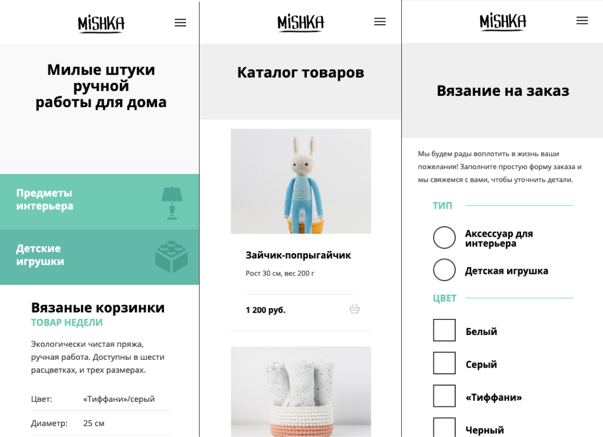

# Web shop (study project)

This project helped me to better understand HTML and CSS, and learn Flexbox at a good level

## Technologies

1. HTML
2. CSS/SASS (Grid, Flex, Bam)
3. Js
4. Gulp

## Screenshots

  
  
  
  

